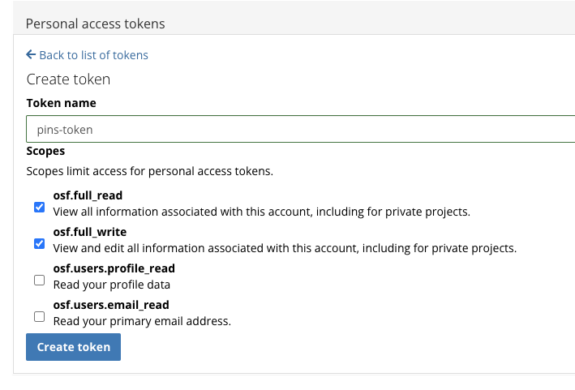

<!-- README.md is generated from README.Rmd. Please edit that file -->

```{r, include = FALSE}
knitr::opts_chunk$set(
  collapse = TRUE,
  comment = "#>",
  fig.path = "man/figures/README-",
  out.width = "100%"
)
```

# pins.osf

<!-- badges: start -->
[](https://lifecycle.r-lib.org/articles/stages.html#experimental)
[](https://github.com/venpopov/pins.osf/actions/workflows/R-CMD-check.yaml)
[](https://app.codecov.io/gh/venpopov/pins.osf?branch=master)
<!-- badges: end -->

The goal of pins.osf is to provide a way to interact with the Open Science Framework (OSF) via the `pins` package. This package is currently in development and is not yet ready for use.

## Installation

You can install the development version of pins.osf like so:

``` r
remotes::install_github("venpopov/pins.osf")
```

## Getting started

1. Register an OSF account at [https://osf.io/](https://osf.io/) if you don't already have one.

2. Generate a personal access token at [https://osf.io/settings/tokens](https://osf.io/settings/tokens). Make a token name specific for your use in pins and give it full read and write access. You must save this token in a secure location as you will not be able to retrieve it later. You must also keep this token secret as it can be used to access your OSF account.

```{r osf-token, echo=F, fig.cap="", out.width=400, fig.align = 'center'}

```

3. Set your OSF token in your `.Renviron` file. You can do this by
    running the following command in R:

``` r
usethis::edit_r_environ()
```

    and adding the following line to the file:

```
OSF_PAT="your-osf-token"
```

    replacing `your-osf-token` with the token you generated in step 2.

4. Create a new OSF project from R using the `osfr` package. For detailed instructions, refer to the [Getting Started](https://docs.ropensci.org/osfr/articles/getting_started.html) guide.

``` r
library(osfr)
project <- osf_create_project("My new project", "This is a description of my new project")
```

5. (optional) add a new component to store the boards:

``` r
boards_comp <- osf_create_component(project, "pin-boards", public = TRUE, category = "data")
```

6. Add a local board via the `pins` package:

```{r}
library(pins)
board <- board_folder("board", versioned = TRUE)
```

7. Pin the project and the boards component information to the board so that we can easily access them in new R sessions:

```{r}
board |> pin_write(project, "project")
board |> pin_write(boards_comp, "boards_comp")
```

```{r echo=FALSE}
# internal cleanup
pins <- board |>
  pin_list() |>
  purr::discard(\(x) x$name %in% c("project", "boards_comp"))
board |> pin_delete(pins)
project <- osfr::osf_retrieve_node("https://osf.io/64bmh/")
boards_comp <- osfr::osf_retrieve_node("https://osf.io/u4wbs/")
```


7. Pin some files to the board:

```{r}
raw_data <- mtcars
board |> pin_write(raw_data, "raw_data")
```

if we rerun it nothing happens because the file is already pinned:

```{r}
board |> pin_write(raw_data, "raw_data")
```

do some preprocessing:

```{r}
preprocessed_data <- raw_data |> dplyr::mutate(cyl = cyl * 3)
board |> pin_write(preprocessed_data, "preprocessed_data")
```

see the state of the board:

```{r}
board |> pin_search()
```

list the saved versions:

```{r}
cat("raw_data versions:\n\n")
board |> pin_versions("raw_data")
cat("\npreprocessed_data versions:\n\n")
board |> pin_versions("preprocessed_data")
```

change something about the preprocessing:

```{r}
preprocessed_data <- preprocessed_data |> dplyr::filter(gear == 4)
board |> pin_write(preprocessed_data, "preprocessed_data")
```

list the saved versions:

```{r}
board |> pin_versions("preprocessed_data")
```


8. Push the board to the OSF project:

First, record the metadata for all the pins stored in the board in a _pins.yaml file (so that people who only have read access to your repository can load it via `board_url`):

# TODO: is this necessary?

```{r}
board |> write_board_manifest()
```


Then, push the board to the OSF project:

```{r}
project |>
  osfr::osf_upload(board$path, recurse = TRUE, conflicts = "skip", verbose = TRUE)
```


9. You can download all files 

# TODO: need to figure out the paths - this collapses everything

```{r}
project |>
  recurse_ls_files()

a |>
  append_correct_path() |>
  split(seq_len(nrow(a))) |>

```