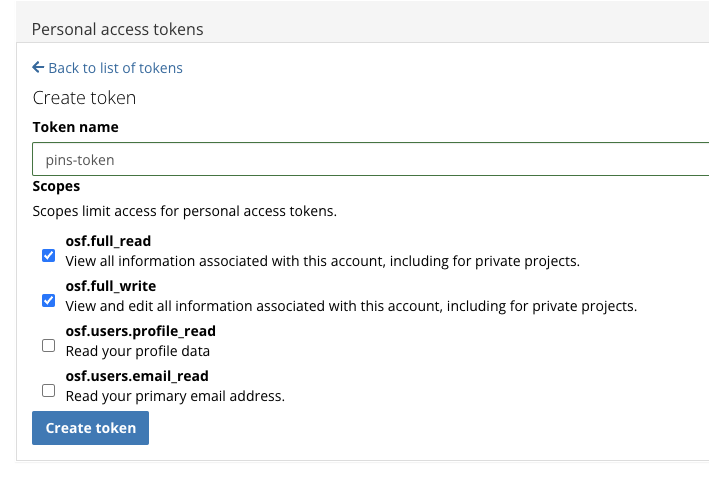

<!-- README.md is generated from README.Rmd. Please edit that file -->

# pins.osf

<!-- badges: start -->

[](https://lifecycle.r-lib.org/articles/stages.html#experimental)
[](https://github.com/venpopov/pins.osf/actions/workflows/R-CMD-check.yaml)
[](https://app.codecov.io/gh/venpopov/pins.osf?branch=master)
<!-- badges: end -->

The goal of pins.osf is to provide a way to interact with the Open
Science Framework (OSF) via the `pins` package. This package is
currently in development and is not yet ready for use.

## Installation

You can install the development version of pins.osf like so:

``` r
remotes::install_github("venpopov/pins.osf")
```

## Getting started

1.  Register an OSF account at <https://osf.io/> if you don’t already
    have one.

2.  Generate a personal access token at
    <https://osf.io/settings/tokens>. Make a token name specific for
    your use in pins and give it full read and write access. You must
    save this token in a secure location as you will not be able to
    retrieve it later. You must also keep this token secret as it can be
    used to access your OSF account.



3.  Set your OSF token in your `.Renviron` file. You can do this by
    running the following command in R:

``` r
usethis::edit_r_environ()
```

    and adding the following line to the file:

    OSF_PAT="your-osf-token"

    replacing `your-osf-token` with the token you generated in step 2.

4.  Create a new OSF project from R using the `osfr` package. For
    detailed instructions, refer to the [Getting
    Started](https://docs.ropensci.org/osfr/articles/getting_started.html)
    guide.

``` r
library(osfr)
project <- osf_create_project("My new project", "This is a description of my new project")
```

5.  (optional) add a new component to store the boards:

``` r
boards_comp <- osf_create_component(project, "pin-boards", public = TRUE, category = "data")
```

6.  Add a local board via the `pins` package:

``` r
library(pins)
board <- board_folder("board", versioned = TRUE)
```

7.  Pin some files to the board:

``` r
raw_data <- mtcars
board |> pin_write(raw_data, "raw_data")
#> Guessing `type = 'rds'`
#> Creating new version '20240422T051154Z-a4a15'
#> Writing to pin 'raw_data'
```

if we rerun it nothing happens because the file is already pinned:

``` r
board |> pin_write(raw_data, "raw_data")
#> Guessing `type = 'rds'`
#> ! The hash of pin "raw_data" has not changed.
#> • Your pin will not be stored.
```

do some preprocessing:

``` r
preprocessed_data <- raw_data |> dplyr::mutate(cyl = cyl * 3)
board |> pin_write(preprocessed_data, "preprocessed_data")
#> Guessing `type = 'rds'`
#> Creating new version '20240422T051154Z-922e3'
#> Writing to pin 'preprocessed_data'
```

see the state of the board:

``` r
board |> pin_search()
#> # A tibble: 2 × 6
#>   name              type  title         created             file_size meta      
#>   <chr>             <chr> <chr>         <dttm>              <fs::byt> <list>    
#> 1 preprocessed_data rds   preprocessed… 2024-04-22 07:11:54     1.19K <pins_met>
#> 2 raw_data          rds   raw_data: a … 2024-04-22 07:11:54     1.19K <pins_met>
```

list the saved versions:

``` r
cat("raw_data versions:\n\n")
#> raw_data versions:
board |> pin_versions("raw_data")
#> # A tibble: 1 × 3
#>   version                created             hash 
#>   <chr>                  <dttm>              <chr>
#> 1 20240422T051154Z-a4a15 2024-04-22 07:11:54 a4a15
cat("\npreprocessed_data versions:\n\n")
#> 
#> preprocessed_data versions:
board |> pin_versions("preprocessed_data")
#> # A tibble: 1 × 3
#>   version                created             hash 
#>   <chr>                  <dttm>              <chr>
#> 1 20240422T051154Z-922e3 2024-04-22 07:11:54 922e3
```

change something about the preprocessing:

``` r
preprocessed_data <- preprocessed_data |> dplyr::filter(gear == 4)
board |> pin_write(preprocessed_data, "preprocessed_data")
#> Guessing `type = 'rds'`
#> Creating new version '20240422T051155Z-7b50c'
#> Writing to pin 'preprocessed_data'
```

list the saved versions:

``` r
board |> pin_versions("preprocessed_data")
#> # A tibble: 2 × 3
#>   version                created             hash 
#>   <chr>                  <dttm>              <chr>
#> 1 20240422T051154Z-922e3 2024-04-22 07:11:54 922e3
#> 2 20240422T051155Z-7b50c 2024-04-22 07:11:55 7b50c
```
